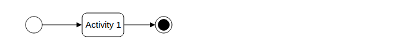
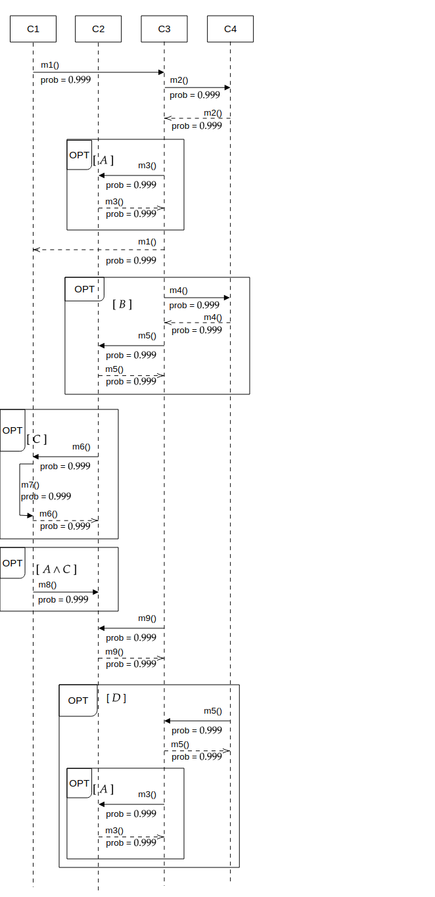

# FReAna

- Funcional toolkit for reliability analysis of product lines.

This project aims to implement some useful tools and techniques
for the analysis of Software Product Lines (SPLs) in Haskell.

It builds upon the work done in the [ReAna](https://github.com/SPLMC/reana-spl) project.

## Usage

This project uses the [Stack](https://docs.haskellstack.org/en/stable/README/) tool.

To build the project.

```sh
$ stack build
```

The current tool reads an XML model file and pretty print the model read.

```sh
$ stack run <XML model file>
```

## Model Files

A model file specifies a behavioral model of a piece of software.
It is composed of an activity diagram, as well as multiple sequence diagrams,
one for each "feature"

Here is an example

<details>

<summary><strong>Activity Diagram</strong></summary>



</details>

<details>

<summary><strong>Sequence Diagram</strong></summary>



</details>

And the corresponding XML file.

<details>

<summary><strong>Behavioral Model XML</strong></summary>

```xml
<?xml version="1.0" encoding="UTF-8"?>
<SplBehavioralModel name="ExampleModel">
  <ActivityDiagram name="AD">
    <Elements>
      <ActivityDiagramElement name="Start node" type="StartNode" />
      <ActivityDiagramElement name="Activity 1" type="Activity" >
        <RepresentedBy seqDiagName="SD" />
      </ActivityDiagramElement>
      <ActivityDiagramElement name="End node" type="EndNode" />
    </Elements>
    <Transitions>
      <Transition name="Start" probability="1.0" source="Start node" target="Activity 1" />
      <Transition name="End"   probability="1.0" source="Activity 1" target="End node" />
    </Transitions>
  </ActivityDiagram>

  <SequenceDiagrams>
    <SequenceDiagram guard="true" name="SD">
      <Message name="m1"       probability="0.999" source="C1" target="C3" type="synchronous"/>
      <Message name="m2"       probability="0.999" source="C3" target="C4" type="synchronous"/>
      <Message name="m2_reply" probability="0.999" source="C4" target="C3" type="synchronous"/>

      <Fragment name="frag_1" type="optional">
        <RepresentedBy seqDiagName="sd_frag_1" />
      </Fragment>

      <Message name="m1_reply" probability="0.999" source="C1" target="C3" type="synchronous"/>

      <Fragment name="frag_2" type="optional">
        <RepresentedBy seqDiagName="sd_frag_2" />
      </Fragment>

      <Fragment name="frag_3" type="optional">
        <RepresentedBy seqDiagName="sd_frag_3" />
      </Fragment>

      <Fragment name="frag_4" type="optional">
        <RepresentedBy seqDiagName="sd_frag_4" />
      </Fragment>

      <Message name="m9"       probability="0.999" source="C3" target="C4" type="synchronous"/>
      <Message name="m9_reply" probability="0.999" source="C4" target="C3" type="synchronous"/>

      <Fragment name="frag_5" type="optional">
        <RepresentedBy seqDiagName="sd_frag_5" />
      </Fragment>

    </SequenceDiagram>

    <SequenceDiagram guard="A" name="sd_frag_1">
      <Message name="m3"       probability="0.999" source="C3" target="C2" type="synchronous" />
      <Message name="m3_reply" probability="0.999" source="C2" target="C3" type="synchronous" />
    </SequenceDiagram>

    <SequenceDiagram guard="B" name="sd_frag_2">
      <Message name="m4"       probability="0.999" source="C3" target="C4" type="synchronous" />
      <Message name="m4_reply" probability="0.999" source="C4" target="C3" type="synchronous" />
      <Message name="m5"       probability="0.999" source="C3" target="C2" type="synchronous" />
      <Message name="m5_reply" probability="0.999" source="C2" target="C3" type="synchronous" />
    </SequenceDiagram>

    <SequenceDiagram guard="C" name="sd_frag_3">
      <Message name="m6"       probability="0.999" source="C2" target="C1" type="synchronous" />
      <Message name="m7"       probability="0.999" source="C1" target="C1" type="synchronous" />
      <Message name="m6_reply" probability="0.999" source="C1" target="C2" type="synchronous" />
    </SequenceDiagram>

    <SequenceDiagram guard="A AND C" name="sd_frag_4">
      <Message name="m8"       probability="0.999" source="C1" target="C2" type="synchronous" />
    </SequenceDiagram>

    <SequenceDiagram guard="D" name="sd_frag_5">
      <Message name="m10"       probability="0.999" source="C4" target="C3" type="synchronous" />
      <Message name="m10_reply" probability="0.999" source="C3" target="C4" type="synchronous" />
      <Fragment name="frag_1" type="optional">
        <RepresentedBy seqDiagName="sd_frag_1" />
      </Fragment>
    </SequenceDiagram>

    <Lifelines>
      <Lifeline name="C1" reliability="1.0" />
      <Lifeline name="C2" reliability="1.0" />
      <Lifeline name="C3" reliability="1.0" />
      <Lifeline name="C4" reliability="1.0" />
    </Lifelines>

    <Fragments>
      <Fragment name="frag_1" type="optional">
        <RepresentedBy seqDiagName="sd_frag_1" />
      </Fragment>
      <Fragment name="frag_2" type="optional">
        <RepresentedBy seqDiagName="sd_frag_2" />
      </Fragment>
      <Fragment name="frag_3" type="optional">
        <RepresentedBy seqDiagName="sd_frag_3" />
      </Fragment>
      <Fragment name="frag_4" type="optional">
        <RepresentedBy seqDiagName="sd_frag_4" />
      </Fragment>
      <Fragment name="frag_5" type="optional">
        <RepresentedBy seqDiagName="sd_frag_5" />
      </Fragment>
    </Fragments>
  </SequenceDiagrams>

</SplBehavioralModel>
```

</details>

For this file, the program produces the following output.

<details>

<summary><strong>Behavioral Model Data</strong></summary>

```
Model
    { mName = "ExampleModel"
    , mActivityDiagram = ActivityDiagram
        { adElements =
            [ ActivityDiagramElement
                { adElementName = "Start node"
                , adElementType = "StartNode"
                , adElementRepBy = Nothing
                }
            , ActivityDiagramElement
                { adElementName = "Activity 1"
                , adElementType = "Activity"
                , adElementRepBy = Just "SD"
                }
            , ActivityDiagramElement
                { adElementName = "End node"
                , adElementType = "EndNode"
                , adElementRepBy = Nothing
                }
            ]
        , adTransitions =
            [ Transition
                { transitionName = "Start"
                , transitionProbability = 1.0
                , transitionSource = "Start node"
                , transitionTarget = "Activity 1"
                }
            , Transition
                { transitionName = "End"
                , transitionProbability = 1.0
                , transitionSource = "Activity 1"
                , transitionTarget = "End node"
                }
            ]
        }
    , mSequenceDiagrams = SequenceDiagrams
        { sdsSequenceDiagrams =
            [ SequenceDiagram
                { sdName = "SD"
                , sdGuard = "true"
                , sdComponents =
                    [ Left
                        ( Message
                            { messageName = "m1"
                            , messageProbability = 0.999
                            , messageSource = "C1"
                            , messageTarget = "C3"
                            , messageType = Synchronous
                            }
                        )
                    , Left
                        ( Message
                            { messageName = "m2"
                            , messageProbability = 0.999
                            , messageSource = "C3"
                            , messageTarget = "C4"
                            , messageType = Synchronous
                            }
                        )
                    , Left
                        ( Message
                            { messageName = "m2_reply"
                            , messageProbability = 0.999
                            , messageSource = "C4"
                            , messageTarget = "C3"
                            , messageType = Synchronous
                            }
                        )
                    , Right
                        ( Fragment
                            { fragmentName = "frag_1"
                            , fragmentType = Optional
                            , fragmentRepBy = Just "sd_frag_1"
                            }
                        )
                    , Left
                        ( Message
                            { messageName = "m1_reply"
                            , messageProbability = 0.999
                            , messageSource = "C1"
                            , messageTarget = "C3"
                            , messageType = Synchronous
                            }
                        )
                    , Right
                        ( Fragment
                            { fragmentName = "frag_2"
                            , fragmentType = Optional
                            , fragmentRepBy = Just "sd_frag_2"
                            }
                        )
                    , Right
                        ( Fragment
                            { fragmentName = "frag_3"
                            , fragmentType = Optional
                            , fragmentRepBy = Just "sd_frag_3"
                            }
                        )
                    , Right
                        ( Fragment
                            { fragmentName = "frag_4"
                            , fragmentType = Optional
                            , fragmentRepBy = Just "sd_frag_4"
                            }
                        )
                    , Left
                        ( Message
                            { messageName = "m9"
                            , messageProbability = 0.999
                            , messageSource = "C3"
                            , messageTarget = "C4"
                            , messageType = Synchronous
                            }
                        )
                    , Left
                        ( Message
                            { messageName = "m9_reply"
                            , messageProbability = 0.999
                            , messageSource = "C4"
                            , messageTarget = "C3"
                            , messageType = Synchronous
                            }
                        )
                    , Right
                        ( Fragment
                            { fragmentName = "frag_5"
                            , fragmentType = Optional
                            , fragmentRepBy = Just "sd_frag_5"
                            }
                        )
                    ]
                }
            , SequenceDiagram
                { sdName = "sd_frag_1"
                , sdGuard = "A"
                , sdComponents =
                    [ Left
                        ( Message
                            { messageName = "m3"
                            , messageProbability = 0.999
                            , messageSource = "C3"
                            , messageTarget = "C2"
                            , messageType = Synchronous
                            }
                        )
                    , Left
                        ( Message
                            { messageName = "m3_reply"
                            , messageProbability = 0.999
                            , messageSource = "C2"
                            , messageTarget = "C3"
                            , messageType = Synchronous
                            }
                        )
                    ]
                }
            , SequenceDiagram
                { sdName = "sd_frag_2"
                , sdGuard = "B"
                , sdComponents =
                    [ Left
                        ( Message
                            { messageName = "m4"
                            , messageProbability = 0.999
                            , messageSource = "C3"
                            , messageTarget = "C4"
                            , messageType = Synchronous
                            }
                        )
                    , Left
                        ( Message
                            { messageName = "m4_reply"
                            , messageProbability = 0.999
                            , messageSource = "C4"
                            , messageTarget = "C3"
                            , messageType = Synchronous
                            }
                        )
                    , Left
                        ( Message
                            { messageName = "m5"
                            , messageProbability = 0.999
                            , messageSource = "C3"
                            , messageTarget = "C2"
                            , messageType = Synchronous
                            }
                        )
                    , Left
                        ( Message
                            { messageName = "m5_reply"
                            , messageProbability = 0.999
                            , messageSource = "C2"
                            , messageTarget = "C3"
                            , messageType = Synchronous
                            }
                        )
                    ]
                }
            , SequenceDiagram
                { sdName = "sd_frag_3"
                , sdGuard = "C"
                , sdComponents =
                    [ Left
                        ( Message
                            { messageName = "m6"
                            , messageProbability = 0.999
                            , messageSource = "C2"
                            , messageTarget = "C1"
                            , messageType = Synchronous
                            }
                        )
                    , Left
                        ( Message
                            { messageName = "m7"
                            , messageProbability = 0.999
                            , messageSource = "C1"
                            , messageTarget = "C1"
                            , messageType = Synchronous
                            }
                        )
                    , Left
                        ( Message
                            { messageName = "m6_reply"
                            , messageProbability = 0.999
                            , messageSource = "C1"
                            , messageTarget = "C2"
                            , messageType = Synchronous
                            }
                        )
                    ]
                }
            , SequenceDiagram
                { sdName = "sd_frag_4"
                , sdGuard = "A AND C"
                , sdComponents =
                    [ Left
                        ( Message
                            { messageName = "m8"
                            , messageProbability = 0.999
                            , messageSource = "C1"
                            , messageTarget = "C2"
                            , messageType = Synchronous
                            }
                        )
                    ]
                }
            , SequenceDiagram
                { sdName = "sd_frag_5"
                , sdGuard = "D"
                , sdComponents =
                    [ Left
                        ( Message
                            { messageName = "m10"
                            , messageProbability = 0.999
                            , messageSource = "C4"
                            , messageTarget = "C3"
                            , messageType = Synchronous
                            }
                        )
                    , Left
                        ( Message
                            { messageName = "m10_reply"
                            , messageProbability = 0.999
                            , messageSource = "C3"
                            , messageTarget = "C4"
                            , messageType = Synchronous
                            }
                        )
                    , Right
                        ( Fragment
                            { fragmentName = "frag_1"
                            , fragmentType = Optional
                            , fragmentRepBy = Just "sd_frag_1"
                            }
                        )
                    ]
                }
            ]
        , sdsLifelines =
            [ Lifeline
                { lifelineName = "C1"
                , lifelineReliability = 1.0
                }
            , Lifeline
                { lifelineName = "C2"
                , lifelineReliability = 1.0
                }
            , Lifeline
                { lifelineName = "C3"
                , lifelineReliability = 1.0
                }
            , Lifeline
                { lifelineName = "C4"
                , lifelineReliability = 1.0
                }
            ]
        , sdsFragments =
            [ Fragment
                { fragmentName = "frag_1"
                , fragmentType = Optional
                , fragmentRepBy = Just "sd_frag_1"
                }
            , Fragment
                { fragmentName = "frag_2"
                , fragmentType = Optional
                , fragmentRepBy = Just "sd_frag_2"
                }
            , Fragment
                { fragmentName = "frag_3"
                , fragmentType = Optional
                , fragmentRepBy = Just "sd_frag_3"
                }
            , Fragment
                { fragmentName = "frag_4"
                , fragmentType = Optional
                , fragmentRepBy = Just "sd_frag_4"
                }
            , Fragment
                { fragmentName = "frag_5"
                , fragmentType = Optional
                , fragmentRepBy = Just "sd_frag_5"
                }
            ]
        }
    }
```

</details>
